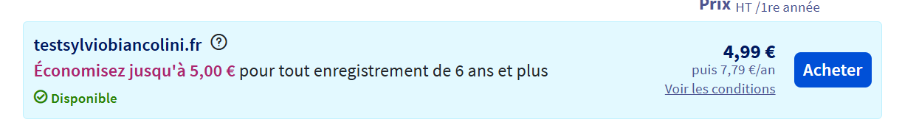

# Questions

Répondez ici aux questions théoriques en détaillant un maxium vos réponses :

1) Expliquer la procédure pour réserver un nom de domaine chez OVH avec des captures d'écran (arrêtez-vous au paiement) :
- Aller sur le site ovhcloud.com
- Cliquer sur l'extention voulu pour le nom de domaine!
[alt text](image.png)
- Vérifier la disponibilité des noms de domaines
- Si disponible l'acheter sinon en chercher un autre 

2. Comment faire pour qu'un nom de domaine pointe vers une adresse IP spécifique ?

3. Comment mettre en place un certificat SSL ?
